# AWS Proactive Monitoring & Auto Remediation & Security Monitoring

## Project Overview

This project demonstrates a proactive monitoring, automated remediation, and security monitoring solution on AWS. Amazon CloudWatch and the CloudWatch Agent continuously monitor a Dev and a Prod EC2 instance for CPU, Memory, and Disk usage. CloudWatch Alarms invoke an AWS Lambda function directly, which reads all three metrics and picks the right remediation action automatically. Amazon SNS delivers email notifications for every operational and security event, while Amazon GuardDuty provides continuous threat detection across both instances.

---

### Architecture Diagram

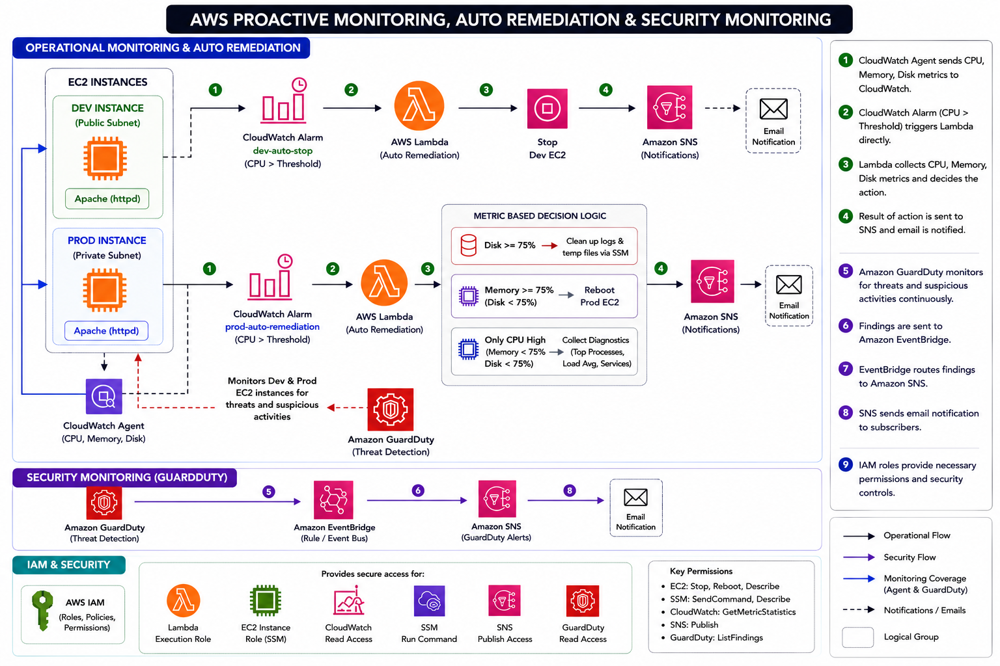

## Architecture Flow

```text
Development EC2 Instance
        │
        ▼
Amazon CloudWatch
        │
        ▼
CloudWatch Alarm (dev-auto-stop)
        │
        ▼
AWS Lambda
        │
        ▼
Stop Development EC2 Instance

────────────────────────────────────────

Production EC2 Instance
        │
        ▼
Amazon CloudWatch (CPU + Memory + Disk via CloudWatch Agent)
        │
        ▼
CloudWatch Alarm (prod-auto-remediation)
        │
        ▼
AWS Lambda reads CPU, Memory, Disk
        │
   ┌────┼────────────────┐
   ▼    ▼                ▼
Disk    Memory          Only CPU
≥ 75%   ≥ 75%           is high
   │    │                │
   ▼    ▼                ▼
SSM     Reboot          Collect Diagnostics
Cleanup Production      (Top Processes,
        Instance         Load Average,
                          Service Status)
   │    │                │
   └────┴────────────────┘
        │
        ▼
   SNS Email Notification

────────────────────────────────────────

Amazon GuardDuty
        │
        ▼
Amazon EventBridge
        │
        ▼
Amazon SNS
        │
        ▼
Email Security Notifications
```

---

## AWS Services Used

* Amazon EC2 (Dev in public subnet, Prod in private subnet)
* Amazon CloudWatch + CloudWatch Agent
* Amazon SNS
* AWS Lambda
* AWS Systems Manager (SSM)
* Amazon GuardDuty
* Amazon EventBridge
* AWS IAM

---

## Key Features

* Automated EC2 monitoring using CloudWatch and the CloudWatch Agent (CPU, Memory, Disk)
* Automated remediation using AWS Lambda, invoked directly by CloudWatch Alarms
* Development EC2 auto-stop functionality
* Production disk cleanup using SSM when disk usage is critical
* Production EC2 automatic reboot when memory usage is critical
* Production CPU-only diagnostics collection instead of blind restarts
* Real-time email notifications through SNS for every outcome
* Continuous threat detection using GuardDuty
* Event-driven security monitoring using EventBridge
* IAM-based access control and permissions

---

## Auto Remediation Implementation

### Development Environment

#### Alarm Name

`dev-auto-stop`

#### Action

When CPU utilization exceeds the configured threshold:

* CloudWatch Alarm enters ALARM state
* Lambda function is invoked directly
* Development EC2 instance is stopped automatically
* Instance state is checked to confirm the stop
* SNS sends an email notification with the result

---

### Production Environment – Disk Cleanup

#### Alarm Name

`prod-auto-remediation`

#### Condition

Disk usage ≥ 75%

#### Action

* CloudWatch Alarm enters ALARM state
* Lambda function is invoked directly and reads CPU, Memory, and Disk
* SSM Run Command executes:

```bash
sudo journalctl --vacuum-time=2d
sudo find /var/log -name '*.log.*' -mtime +7 -delete
sudo rm -rf /tmp/*
```

* Command status is checked to confirm success
* SNS sends an email notification with the result

---

### Production Environment – EC2 Reboot

#### Alarm Name

`prod-auto-remediation`

#### Condition

Memory usage ≥ 75% (and disk is not critical)

#### Action

* CloudWatch Alarm enters ALARM state
* Lambda function is invoked directly and reads CPU, Memory, and Disk
* Production EC2 instance is rebooted automatically
* Instance state is checked to confirm the reboot
* SNS sends an email notification with the result

---

### Production Environment – CPU Diagnostics

#### Alarm Name

`prod-auto-remediation`

#### Condition

Only CPU is high (Memory and Disk are normal)

#### Action

Instead of restarting anything automatically, the Lambda collects live diagnostic data via SSM and emails it, so a human can decide if further action is needed:

* Top CPU-consuming processes
* System load average
* Apache (httpd) service status

---

## Security Monitoring

### Amazon GuardDuty

GuardDuty continuously monitors both EC2 instances for suspicious activities and potential threats.

### EventBridge Integration

EventBridge captures GuardDuty findings and forwards them to SNS.

### Amazon SNS

SNS sends email notifications whenever a security finding is detected.

### Sample Findings

* Port Scanning
* Reconnaissance Activities
* Unauthorized Access Attempts
* Cryptocurrency Mining Activities

---

## IAM Configuration

### Lambda Execution Role

Configured with permissions for:

* EC2 Instance Management (stop, reboot, describe)
* SSM Command Execution
* CloudWatch Metric Reads and Logging
* SNS Publish

### EC2 IAM Role

Attached Policy:

* AmazonSSMManagedInstanceCore

### Lambda Invoke Permissions

CloudWatch Alarms configured to invoke Lambda directly as an alarm action, with no SNS topic or EventBridge rule required in that path.

### EventBridge & SNS Permissions

* EventBridge configured to publish messages to SNS
* SNS Topic Policy configured to allow EventBridge access
* GuardDuty uses AWS-managed service-linked role

---

## Validation Performed

* Verified CloudWatch Alarm state changes for CPU, Memory, and Disk scenarios
* Verified Lambda invocation directly from CloudWatch Alarms
* Verified Development EC2 stop action
* Verified Production disk cleanup through SSM
* Verified Production EC2 reboot action
* Verified Production CPU diagnostics collection and email content
* Verified SNS email notifications for every outcome
* Verified GuardDuty findings generation
* Verified EventBridge event routing to SNS
* Verified CloudWatch Logs generation and Lambda timeout configuration

---

## Screenshots


### Amazon CloudWatch – Alarms

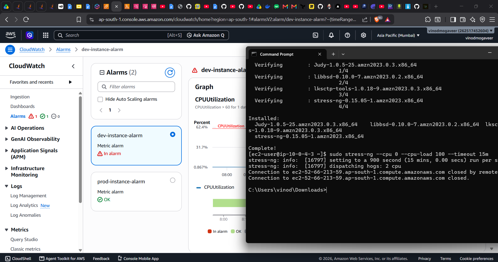

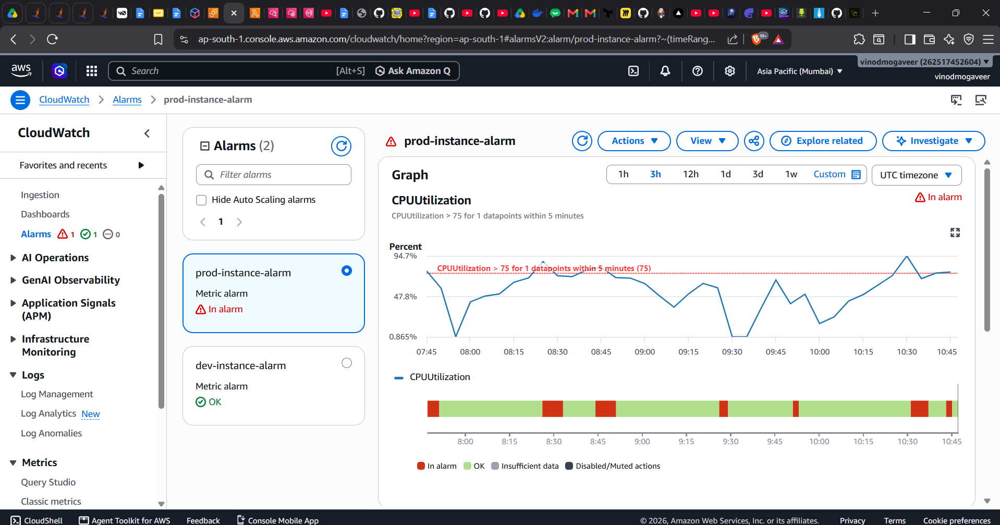

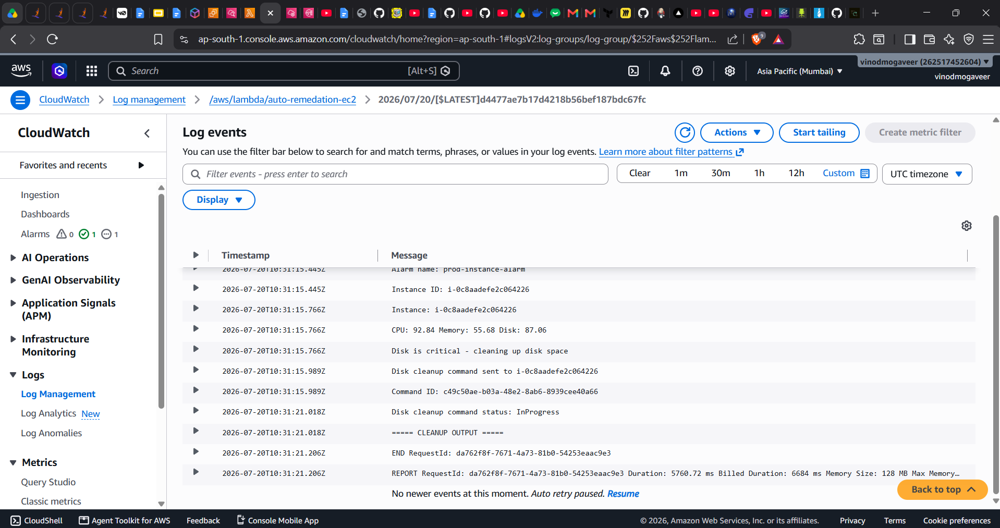

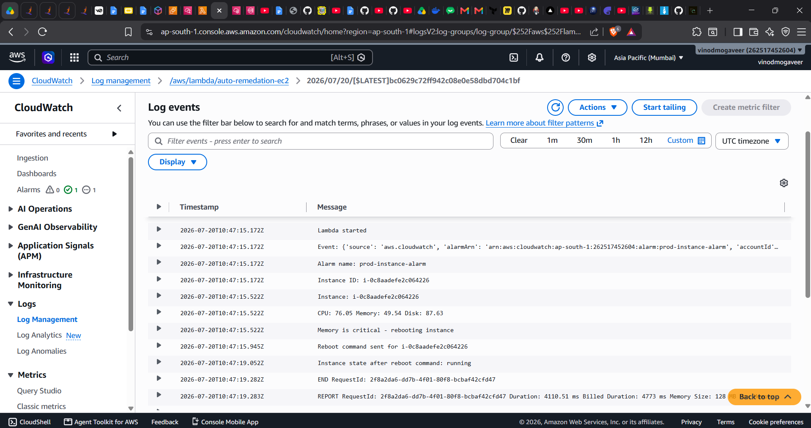

### Auto Remediation Results

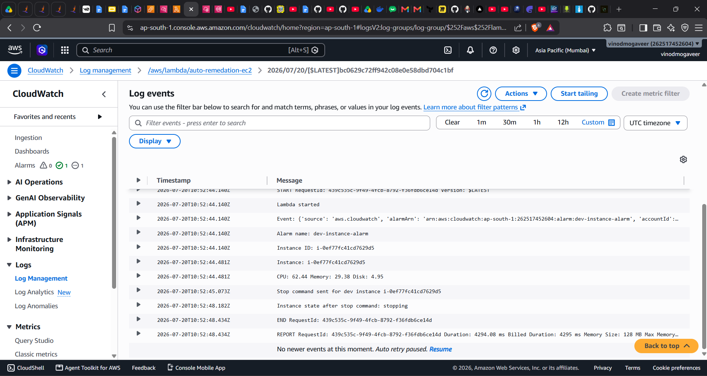

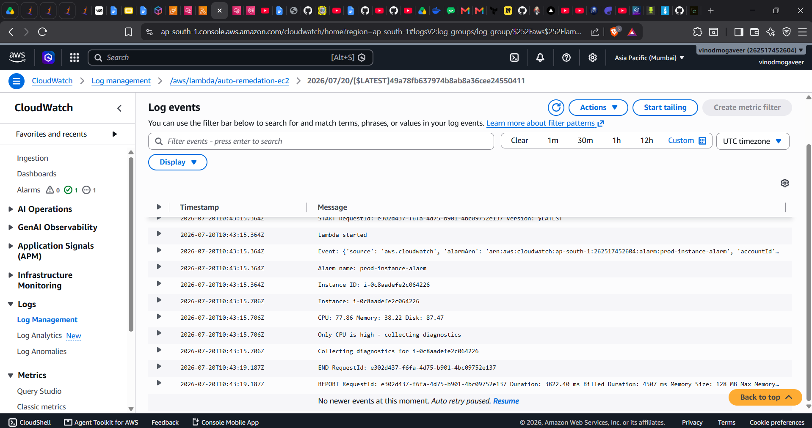

### Amazon SNS

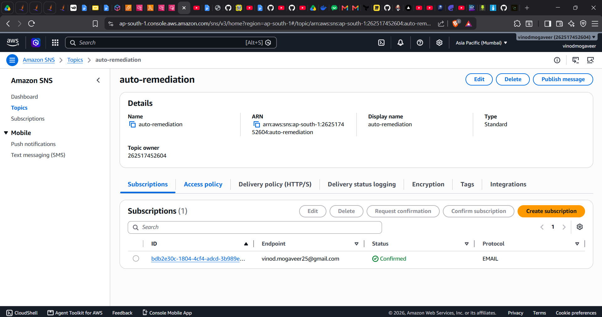

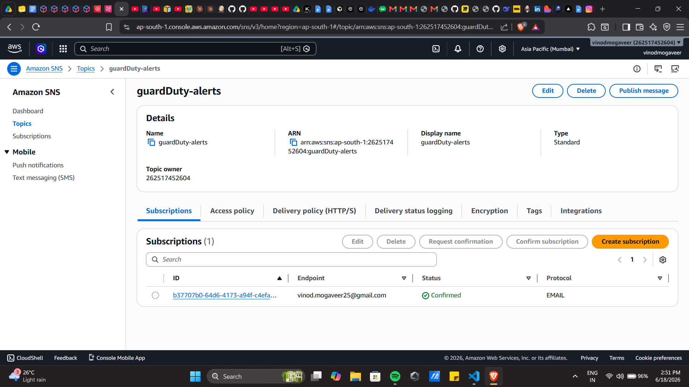

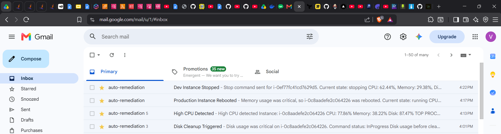

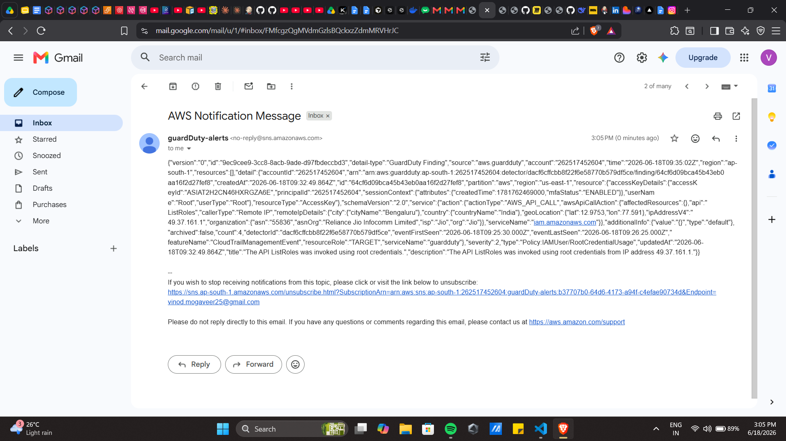

### AWS Lambda

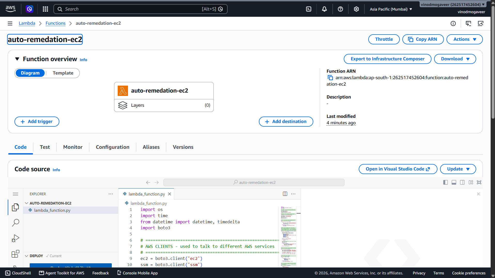

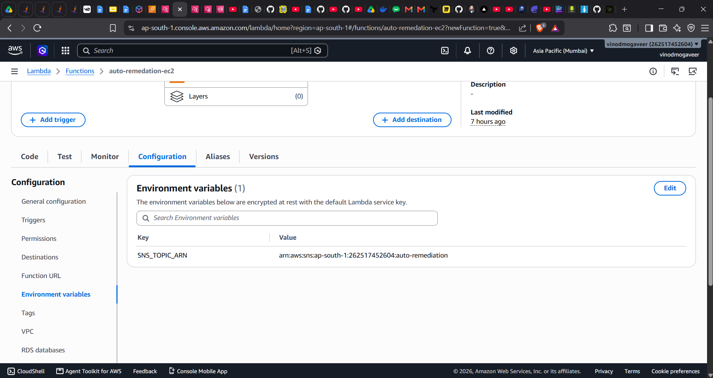

### AWS Systems Manager (SSM)

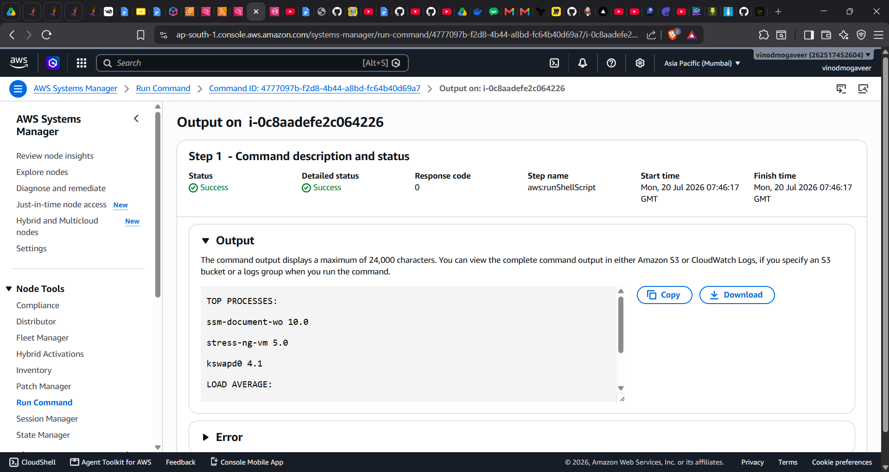

### IAM Configuration

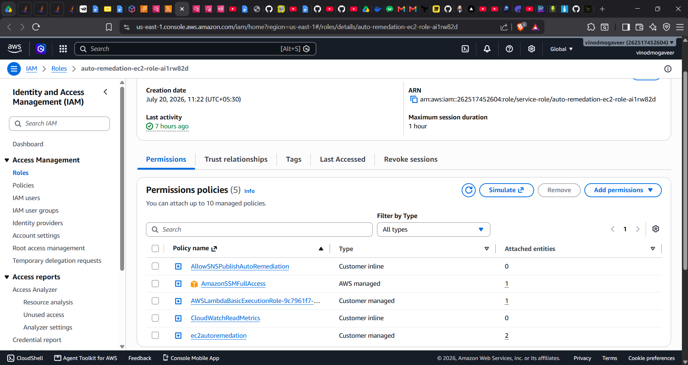

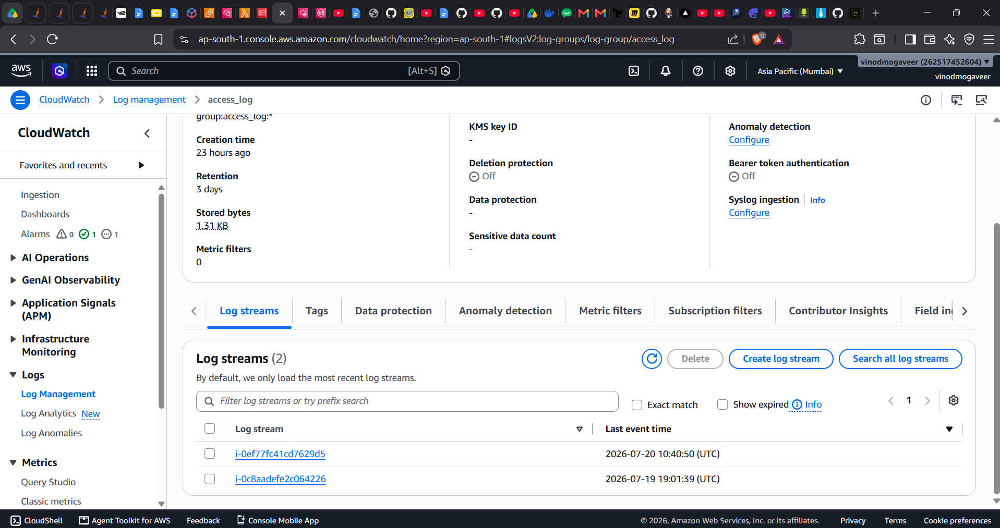

### Amazon GuardDuty

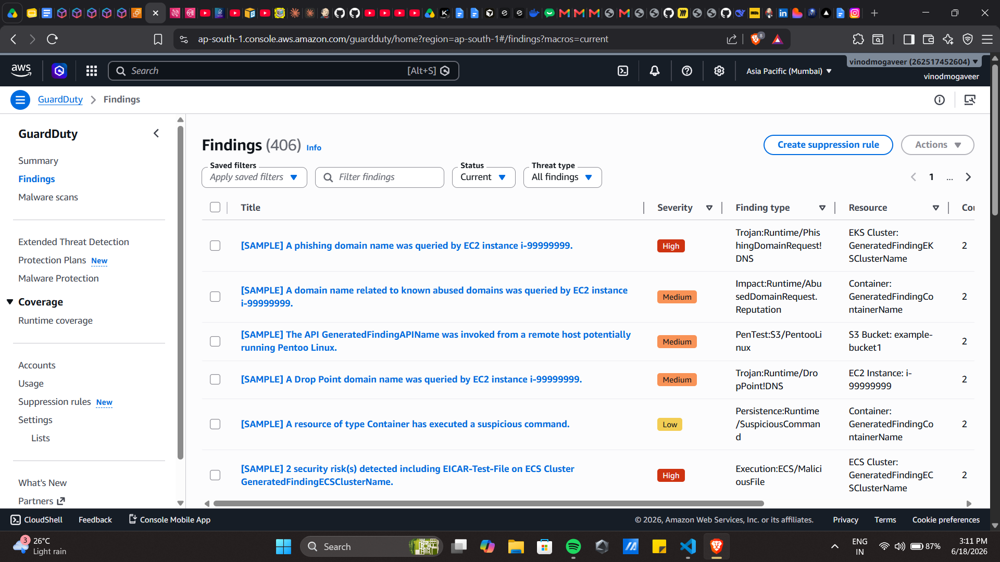

### Amazon EventBridge

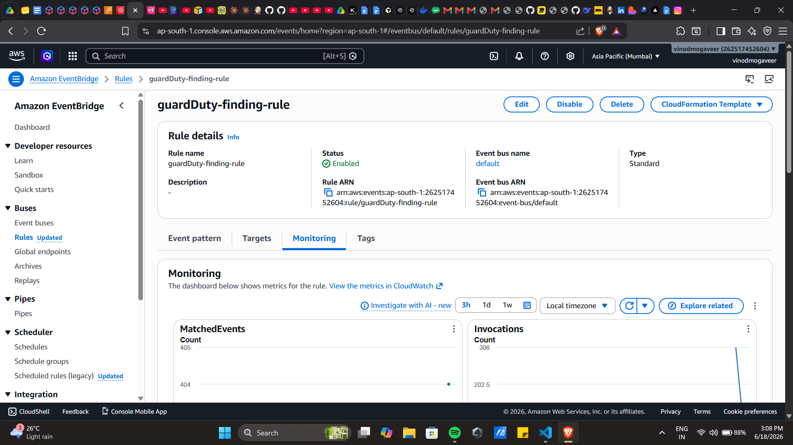

---

## Known Limitations

* No verification beyond a single status check shortly after each action runs
* No cooldown between repeated alarm triggers within a short window
* No escalation logic between a lighter fix and a full reboot
* Disk cleanup targets specific safe locations only (`/var/log`, journal logs, `/tmp`), not the largest files on disk, to avoid deleting unrelated data
* No Application Load Balancer or Auto Scaling Group — a single Dev and single Prod instance are used

---

## Skills Demonstrated

* AWS Cloud Operations
* Cloud Monitoring
* Cloud Security
* AWS Lambda Automation
* AWS Systems Manager (SSM)
* Event-Driven Architecture
* Infrastructure Monitoring
* Security Incident Detection
* IAM and Access Control
* Troubleshooting & Incident Response

---

## Tech Stack

AWS (EC2, CloudWatch, CloudWatch Agent, SNS, Lambda, SSM, GuardDuty, EventBridge, IAM), Python (Boto3), Linux, Cloud Monitoring, Automation, Cloud Security

---

## Author

**Vinod kumar**
