# AWS Proactive Monitoring, Auto Remediation & Security Monitoring

## Project Overview

This project demonstrates a proactive monitoring, automated remediation, and security monitoring solution on AWS. Amazon CloudWatch continuously monitors EC2 instances and automatically triggers remediation actions through AWS Lambda. Amazon SNS delivers email notifications for operational and security events, while Amazon GuardDuty provides continuous threat detection and security monitoring.

---

## Architecture Flow

```text
Development EC2 Instance
        │
        ▼
Amazon CloudWatch
        │
        ▼
CloudWatch Alarm (projecct_proactive)
        │
        ▼
AWS Lambda
        │
        ▼
Stop Development EC2 Instance

────────────────────────────────────────

Production EC2 Instance
        │
        ▼
Amazon CloudWatch
        │
        ▼
CloudWatch Alarm (prod-restart-private)
        │
        ▼
AWS Lambda
        │
        ▼
AWS Systems Manager (SSM)
        │
        ▼
Restart Apache (httpd)

────────────────────────────────────────

Production EC2 Instance
        │
        ▼
Amazon CloudWatch
        │
        ▼
CloudWatch Alarm (prod_auto_remedation)
        │
        ▼
AWS Lambda
        │
        ▼
Reboot Production EC2 Instance

────────────────────────────────────────

Amazon GuardDuty
        │
        ▼
Amazon EventBridge
        │
        ▼
Amazon SNS
        │
        ▼
Email Security Notifications
```

---

## AWS Services Used

* Amazon EC2
* Amazon CloudWatch
* Amazon SNS
* AWS Lambda
* AWS Systems Manager (SSM)
* Amazon GuardDuty
* Amazon EventBridge
* AWS IAM

---

## Key Features

* Automated EC2 monitoring using CloudWatch
* Automated remediation using AWS Lambda
* Development EC2 auto-stop functionality
* Production Apache service restart using SSM
* Production EC2 automatic reboot
* Real-time email notifications through SNS
* Continuous threat detection using GuardDuty
* Event-driven security monitoring using EventBridge
* IAM-based access control and permissions

---

## Auto Remediation Implementation

### Development Environment

#### Alarm Name

`projecct_proactive`

#### Action

When CPU utilization exceeds the configured threshold:

* CloudWatch Alarm enters ALARM state
* Lambda function is triggered
* Development EC2 instance is stopped automatically
* SNS sends an email notification

---

### Production Environment – Apache Restart

#### Alarm Name

`prod-restart-private`

#### Action

When CPU utilization exceeds the configured threshold:

* CloudWatch Alarm enters ALARM state
* Lambda function is triggered
* SSM Run Command executes:

```bash
sudo systemctl restart httpd
```

* Apache service is restarted successfully
* SNS sends an email notification

---

### Production Environment – EC2 Reboot

#### Alarm Name

`prod_auto_remedation`

#### Action

When CPU utilization exceeds the configured threshold:

* CloudWatch Alarm enters ALARM state
* Lambda function is triggered
* Production EC2 instance is rebooted automatically
* SNS sends an email notification

---

## Security Monitoring

### Amazon GuardDuty

GuardDuty continuously monitors the AWS environment for suspicious activities and potential threats.

### EventBridge Integration

EventBridge captures GuardDuty findings and forwards them to SNS.

### Amazon SNS

SNS sends email notifications whenever a security finding is detected.

### Sample Findings

* Port Scanning
* Reconnaissance Activities
* Unauthorized Access Attempts
* Cryptocurrency Mining Activities

---

## IAM Configuration

### Lambda Execution Role

Configured with permissions for:

* EC2 Instance Management
* SSM Command Execution
* CloudWatch Logging

### EC2 IAM Role

Attached Policy:

* AmazonSSMManagedInstanceCore

### Lambda Invoke Permissions

CloudWatch Alarms configured to invoke Lambda automatically.

### EventBridge & SNS Permissions

* EventBridge configured to publish messages to SNS
* SNS Topic Policy configured to allow EventBridge access
* GuardDuty uses AWS-managed service-linked role

---

## Validation Performed

* Verified CloudWatch Alarm state changes
* Verified Lambda invocation
* Verified Development EC2 stop action
* Verified Apache restart through SSM
* Verified Production EC2 reboot action
* Verified SNS email notifications
* Verified GuardDuty findings generation
* Verified EventBridge event routing
* Verified CloudWatch Logs generation

---

## Screenshots

### Architecture Diagram


### Amazon EC2

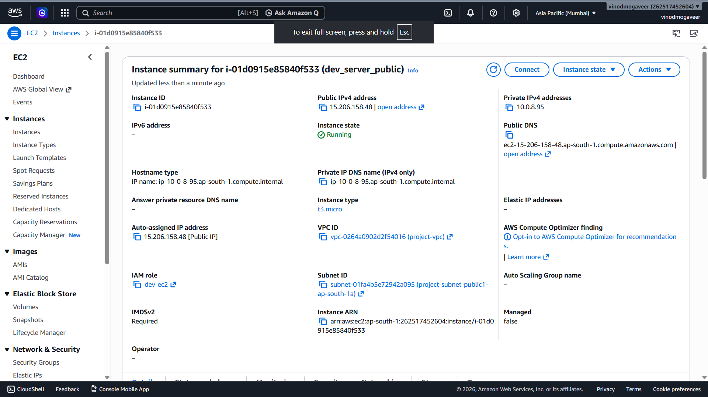

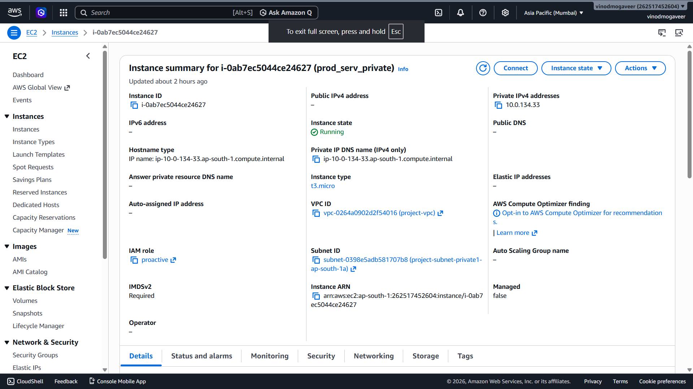

### Amazon CloudWatch


-dev-alarm.png)

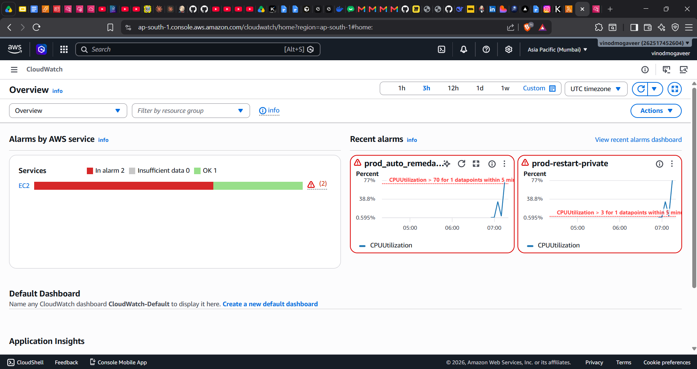

### Amazon SNS

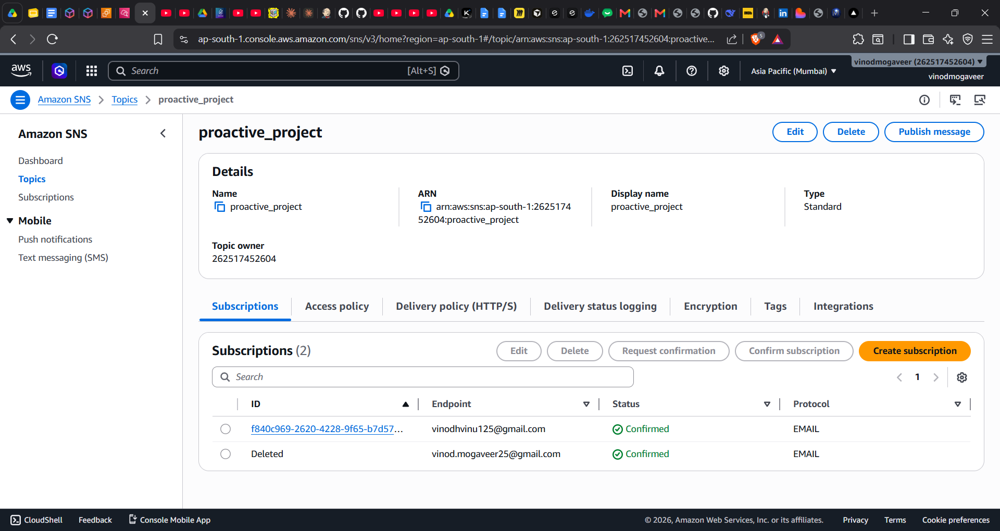


### AWS Lambda

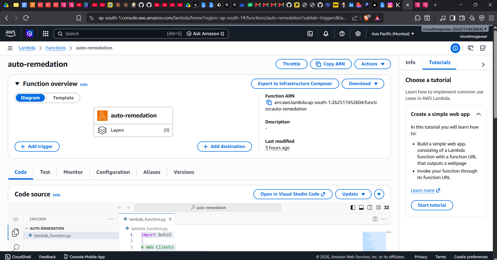

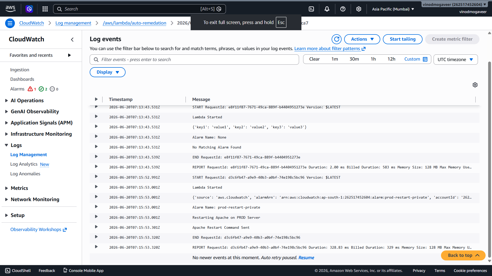

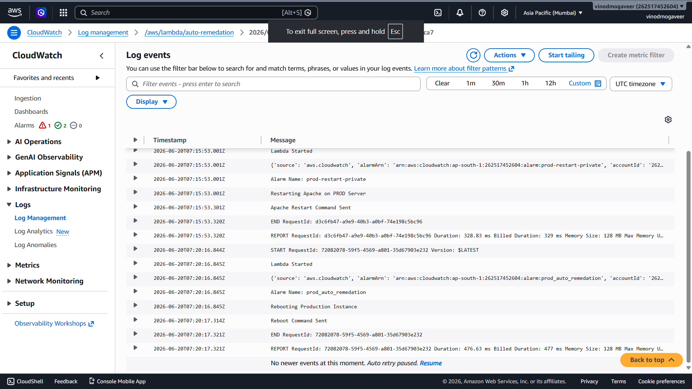

### AWS Systems Manager (SSM)

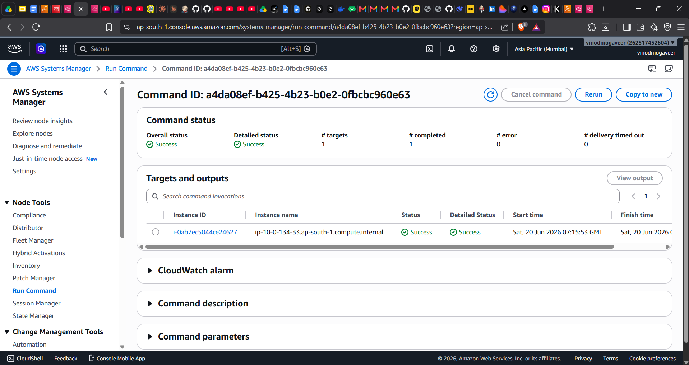

### IAM Configuration

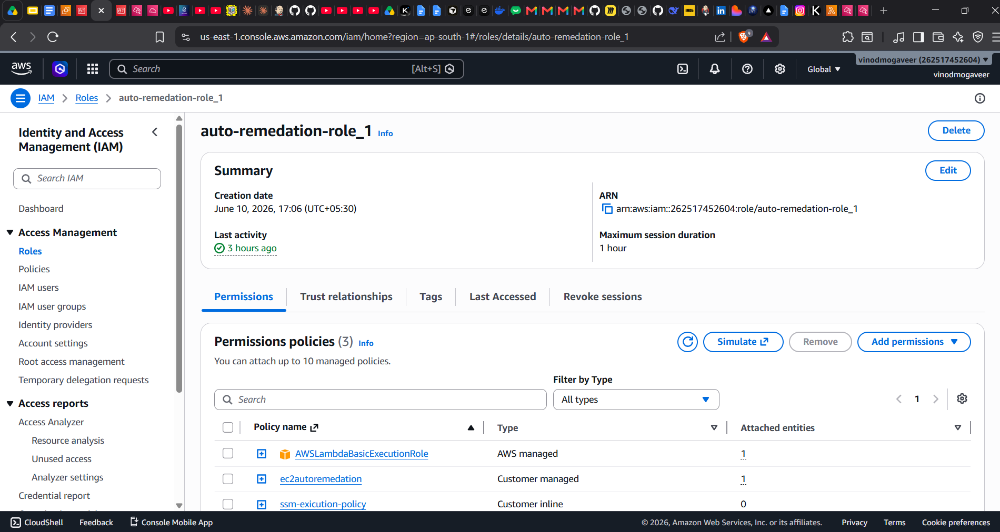

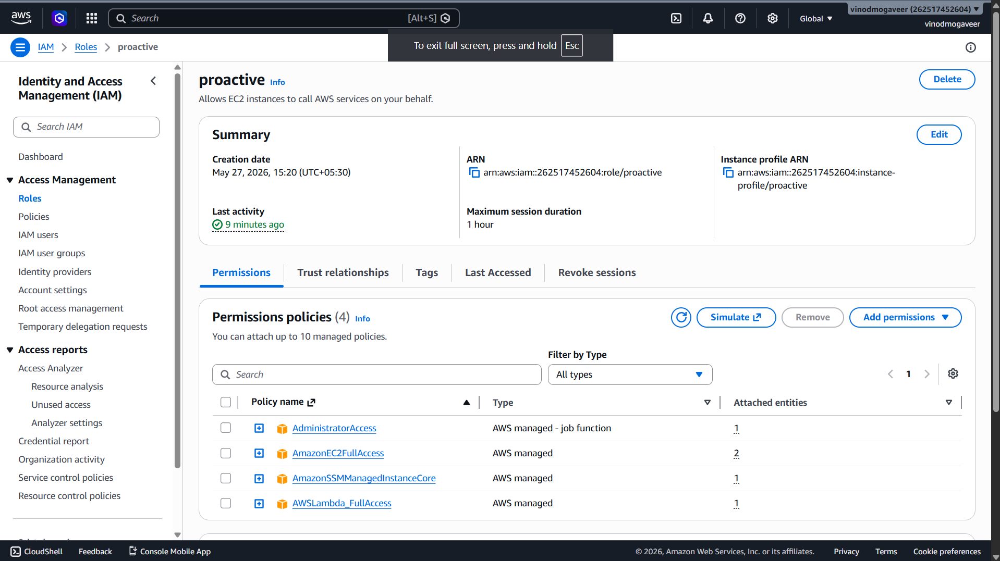

### Amazon GuardDuty


### Amazon EventBridge


### Permissions

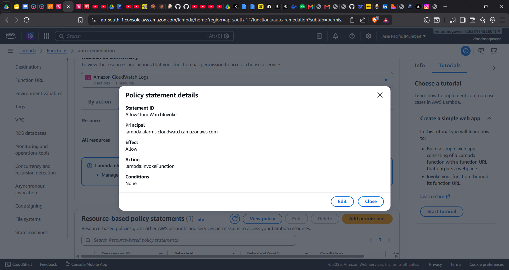

### Auto Remediation Results

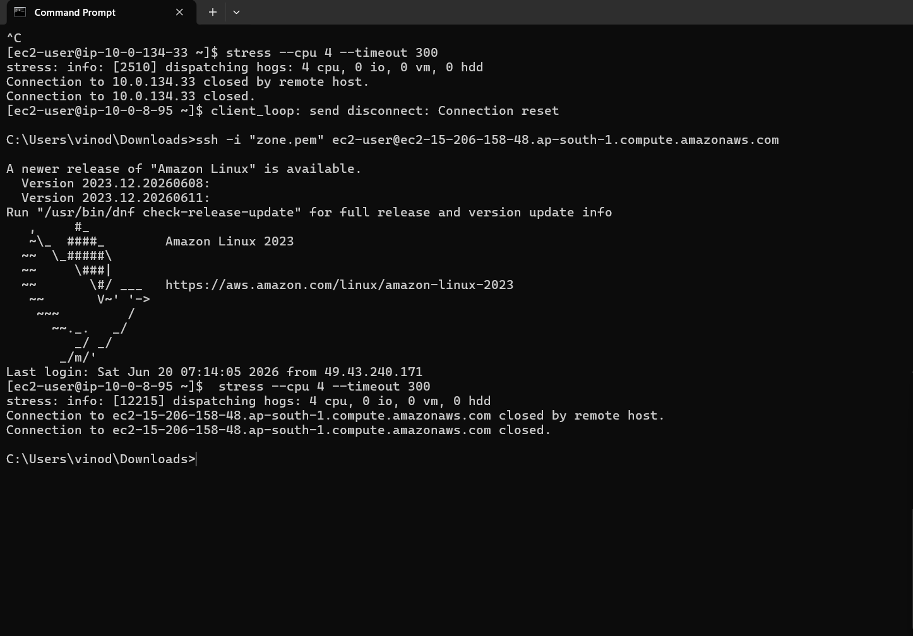


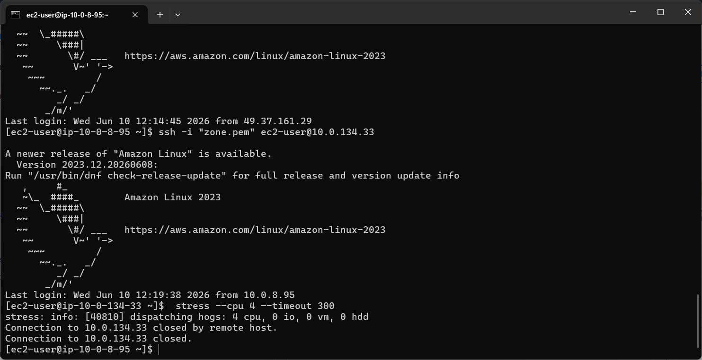

---

## Skills Demonstrated

* AWS Cloud Operations
* Cloud Monitoring
* Cloud Security
* AWS Lambda Automation
* AWS Systems Manager (SSM)
* Event-Driven Architecture
* Infrastructure Monitoring
* Security Incident Detection
* IAM and Access Control
* Troubleshooting & Incident Response

---

## Tech Stack

AWS (EC2, CloudWatch, SNS, Lambda, SSM, GuardDuty, EventBridge, IAM), Linux, Cloud Monitoring, Automation, Cloud Security
